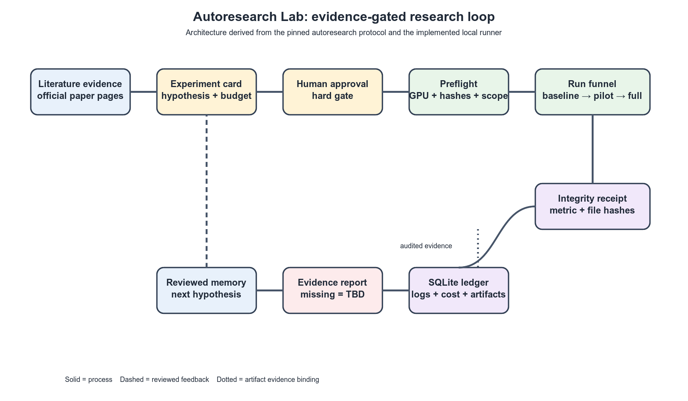
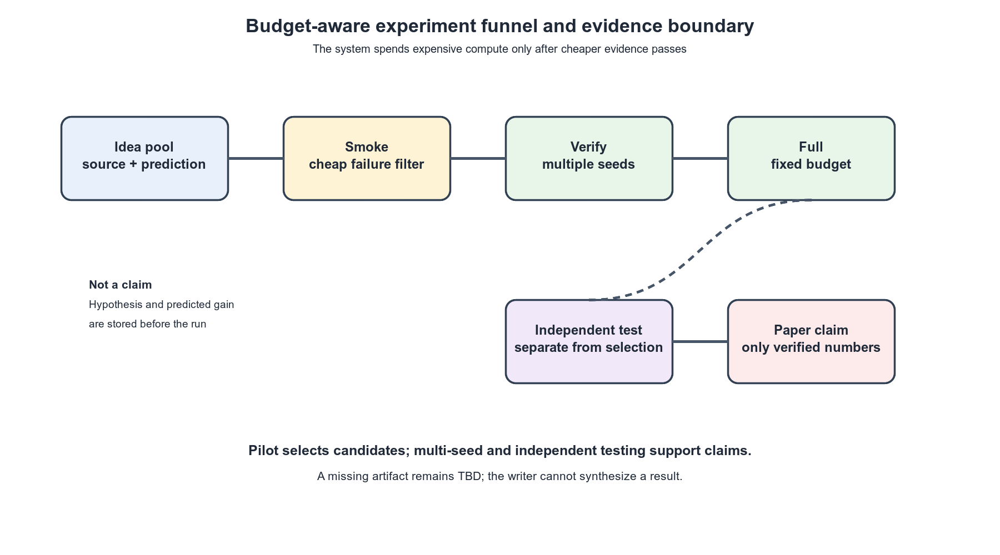
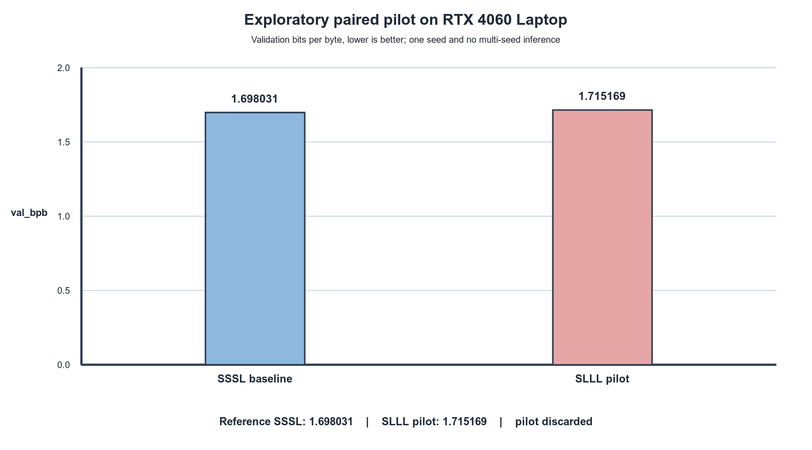

# Autoresearch Lab: an evidence-bound workflow for budgeted single-GPU experiments

> Preliminary working draft, 2026-10-05. This document is a research scaffold, not a submission. Every unsupported value is marked `TBD`.

## Abstract

Autoresearch systems can shorten the loop from an idea to a runnable experiment,
but unattended optimization can also hide protocol drift, resource contention,
metric tampering, and unsupported paper claims. We implement a local-first
workflow that binds a literature-backed hypothesis to an experiment card,
requires an approval record, performs GPU and change-scope preflight, executes
a fixed evaluation chain, stores logs and artifacts in a SQLite ledger, and
generates an evidence-bound report. The first adapter targets the pinned
Karpathy autoresearch protocol, whose evaluator reports validation bits per
byte (`val_bpb`) under a fixed five-minute training budget.

On the available RTX 4060 Laptop, the untouched upstream training file did not
fit the default micro-batch. A clean batch-16 adaptation completed with
`val_bpb=1.698031`; the paired `SLLL` pilot produced `1.715169` and was
discarded. These two numbers support a reproducible negative pilot finding,
not an improvement claim.

## 1. Problem and scope

The target is a sustainable research loop rather than an autonomous claim
generator. The workflow must answer four questions for every candidate:

1. What evidence motivated the candidate?
2. What exact code, data, evaluator, time budget, and metric are fixed?
3. Did the run execute on an uncontended device and within the declared change
   boundary?
4. Which numbers are independently supported well enough to enter a paper?

The current implementation is local-first. It does not claim that a local
process lifecycle record is a cloud allocation, and it does not claim RTX 4060
results are comparable with upstream H100 results.

## 2. Related open-source systems

The implementation combines narrowly selected behaviors from public projects:

- [Karpathy autoresearch](https://github.com/karpathy/autoresearch) supplies
  the fixed evaluator, one-file training boundary, and five-minute loop.
- [scholar-loop](https://github.com/renee-jia/scholar-loop) motivates frozen
  scoring, smoke/verify/full stages, and a run ledger.
- [autolab](https://github.com/a0merr/autolab) motivates versioned artifacts,
  replay, guards, and stop conditions.
- [EvoMap AutoResearch](https://github.com/EvoMap/AutoResearch),
  [FAROS](https://github.com/OpenNSWM-Lab/FAROS), and
  [Agon](https://github.com/AutoResearch-Factory/Agon) motivate provenance,
  review gates, and paper/figure evidence checks.
- [AI-Scientist-v2](https://github.com/SakanaAI/AI-Scientist-v2) is treated as
  a conceptual reference only because its source license requires a separate
  redistribution decision.

The repository and commit audit is recorded in `docs/OSS_AUDIT.md`; the public
repositories were not exhaustively searched, so “best” is not a verified global
claim.

## 3. System design

The control flow is:

`literature → experiment card → approval → preflight → baseline → pilot → full → multi-seed → analysis → report → archive`

The runner records the command, seed, environment sanitization, GPU preflight,
stdout, stderr, metric extraction, peak VRAM when reported, code-scope
verification, rollback outcome, runtime, and cost. A missing field stays
`TBD`. The executable implementation is under `labctl/`.

The figures are architecture drafts audited in `docs/figures/audit_report.md`.
The pilot plot is a single-seed exploratory comparison and is not a multi-seed
performance claim.

## 4. Experimental protocol

The adapter uses the pinned upstream checkout at commit
`228791fb499afffb54b46200aca536f79142f117`. The protected evaluator is
`prepare.py:evaluate_bpb`; the protocol uses sequence length 2048 and a
five-minute training budget. The hardware adaptation changes only
`DEVICE_BATCH_SIZE` from 128 to 16 after a clean batch-32 OOM on the available
device. This is a
hardware adaptation, not a new algorithm and not an H100-comparable result.

The primary innovation candidate was a pre-registered attention-window
allocation ablation, `SSSL` versus `SLLL`. The paired pilot was worse by
`0.017138` `val_bpb` and was discarded. A paper claim would require a new
candidate or rationale, confirmation under multiple seeds, and an independent
test when the task provides one.

## 5. Results ledger

| Experiment | Stage | Seed | Status | `val_bpb` | Interpretation |
|---|---|---:|---|---:|---|
| `nanochat-local` | baseline | 42 | crash | `TBD` | Untouched protocol OOM on the available device. |
| `nanochat-rtx4060` | baseline | 42 | crash | `TBD` | Adapted micro-batch still OOM while another training process used about 3,088 MiB; not a clean limit. |
| `nanochat-rtx4060` | baseline | 42 | crash | `TBD` | Clean batch-32 attempt still OOM with only Chrome using about 13 MiB; this is a feasibility boundary, not a quality result. |
| `nanochat-rtx4060-b16` | baseline | 42 | contested crash | `TBD` | A late GPU process used about 490 MiB at the OOM; no batch-16 feasibility conclusion is valid. |
| `nanochat-rtx4060-b16` | baseline | 42 | keep | 1.698031 | Clean batch-16 reference; 543.3 seconds and 6150.2 MiB peak VRAM. |
| `nanochat-window-slll-b16` | pilot | 42 | discard | 1.715169 | Paired SLLL pilot; 0.017138 higher than the reference, so it was rolled back. |

The exact logs, preflight snapshots, and integrity receipts are stored under
`runs/`, with the SQLite ledger at `artifacts/ledger.sqlite3`. The adapted
experiment reports are `reports/nanochat-rtx4060-b16-draft.md` and
`reports/nanochat-window-slll-b16-draft.md`.

## 6. Limitations and risks

The available device has produced one clean batch-16 baseline, but no
improvement claim, confidence interval, ranking, or cost-performance
conclusion is valid.
GPU contention is an external confounder. The framework detects it before and
after a run and stops or marks a contested crash; it does not solve capacity
planning. Cloud provisioning is also not yet
implemented, and the local `server create` command must not be described as
cloud infrastructure. The current literature audit is broad but finite, and
license compatibility must be reviewed before vendoring external code. Two
early retry records used the pre-fix stage/seed directory layout and therefore
share an overwritten artifact path; the ledger marks this collision and those
records are excluded from claim evidence. New runs use a unique run directory.

## 7. Planned next evidence

The `SLLL` candidate is stopped after its negative pilot. A future candidate
must be separately pre-registered and compared with the locked batch-16
reference before any full or multi-seed spend. Regenerate this draft from the
ledger after each evidence boundary. The current contribution is the
reproducible workflow, its audit trail, and a negative pilot result rather than
a claimed modeling gain.
